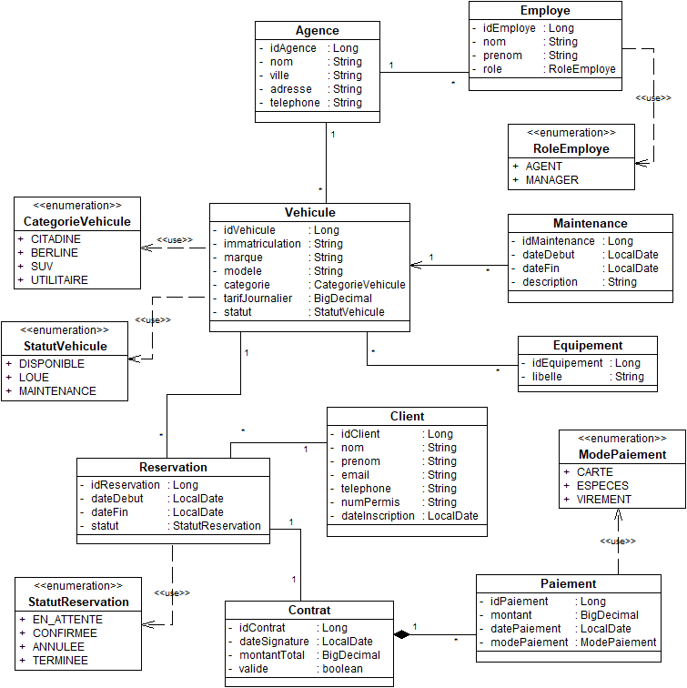

# AutoLoc 🚗

AutoLoc est un projet Spring Boot réalisé dans le cadre du module
**Architecture des Systèmes d’Information (ASI)** à **ESPRIT**.

Le projet consiste à développer progressivement une plateforme de gestion
de location de véhicules multi-agences.

L'objectif est de mettre en pratique les notions étudiées durant le semestre.
Chaque séance permet d'ajouter une nouvelle fonctionnalité ou une nouvelle
notion d'architecture au projet.

## Modèle du système

Le modèle présente les principales entités du système AutoLoc ainsi que
leurs relations :

## Technologies

- Java
- Spring Boot
- Spring Data JPA
- Spring MVC
- MySQL / PostgreSQL
- Maven
- Git & GitHub
- Swagger / OpenAPI

## Notions abordées

Au fil du semestre, le projet permettra notamment de travailler sur :

- Architecture en couches
- Entités JPA et associations
- Repository et Service
- API REST
- DTO et validation
- Principes SOLID
- Design Patterns
- Transactions
- JPQL et pagination
- Spring Scheduler
- Spring AOP
- Qualité et analyse du code

> Projet réalisé progressivement dans le cadre du module
> **Architecture des Systèmes d’Information — ESPRIT 2026/2027**.
